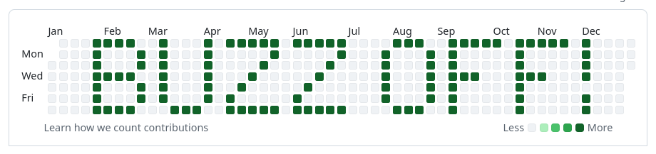

# Godspeed


**Godspeed** is a tool to programmatically manipulate your GitHub contribution graph to display custom messages as a protest against toxic tech culture.

## But Why?

The tech industry has become obsessed with performative productivity, where your worth is measured by how many green squares you have on GitHub, how many side projects you maintain, and how many hours you grind, beyond your already soul-crushing long working hours.

This repo is a middle finger to:
- **Tech Bros™** who think burnout is a badge of honor
- **Recruiters and Organizations** that demand open-source contributions like they're mandatory
- **The entire notion** that your GitHub activity graph reflects your value as a developer

## Installation & Usage

### Prerequisites
- [Python 3.8+](https://www.python.org/downloads/)
- [Git](https://git-scm.com/downloads)
- [GitHub CLI](https://cli.github.com/) (`gh`) installed and authenticated

### Quick Start
```bash
# Clone the repo
git clone git@github.com:badukoos/godspeed.git
cd godspeed

# Enforce local user configs (required for contribution graphs to display properly)
git config --local user.name  "your-git-userid"
git config --local user.email "your-git-email"

# Add your git remote
git remote set-url origin git@github.com:your-git-userid/godspeed.git

# Optionally verify your configs
git config --local --list

# Basic usage
# --mode latest displays the message for the default view, i.e last 365 days
# --reset makes sure you start with a clean slate (i.e it wipes out my dummy changes included in the repo)
python scripts/godspeed.py "BUZZ OFF!" --mode latest --reset

```

### Additional Options
```bash
# Displays the message in the year 2022 of the contribution graph
python scripts/godspeed.py "BUZZ OFF!" --mode year --year 2022

# Displays the message starting from the neearst Sunday to 2025-03-01 (YYYY-MM-DD)
python scripts/godspeed.py "BUZZ OFF!" --mode latest --start-date 2025-03-01

# Use the --reset option for a clean slate
python scripts/godspeed.py "BUZZ OFF!" --mode latest --reset

# Change default visibility of the repo (private) to public
python scripts/godspeed.py "BUZZ OFF!" --mode year --year 2022 --visibility public
```
#### GitHub contribution graph (example)


### Troubleshooting
- If `godspeed.py` can't automatically determine the repo owner, you can manually replace `get_repo_owner()` in the main function with a hardcoded value.
- I created a [gist](https://gist.github.com/badukoos/229e7a24f1d897c904264947c7fe03d0) that might be useful for trubleshooting various git related issues.

## Important Notes

- The `--reset` flag will completely wipe your godspeed repo history (local and remote)
- Only uppercase letters `A-Z` and exclamation points (`!`) are supported
- Your contribution graph updates _may not_ immediately reflect on Github
- This repo goes well with empty GitHub accounts
- This repo is meant to be **snark and satire**

## License
This project is licensed under the [WTFPL (Do What the Fuck You Want To Public License)](https://www.wtfpl.net/about/).

## Post Script
_"The only good tech bro is a tech bro who's logged off" -Karl Marx_ (I think)